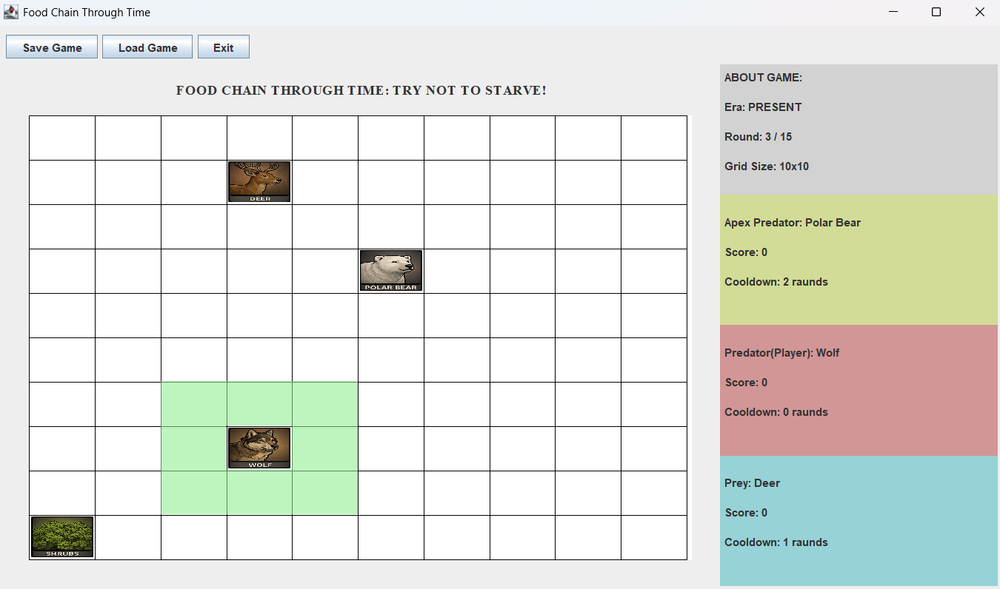

# Food Chain Through Time

  

**"Try Not To Starve!"**

This project is a turn-based ecosystem simulation game developed as a term project for the **Ko?? University COMP132 (Advanced Programming)** course. It is built using **Java Swing** and strictly adheres to **Object-Oriented Programming (OOP)** principles and the **Model-View-Controller (MVC)** architectural pattern.

---

## Project Report

For a comprehensive technical overview, including UML diagrams and algorithm details, please refer to the detailed project report:

### [View Project Report (PDF)](doc/gameReport.pdf)

---

## Gameplay

  

## Key Features

* **Three Historical Eras:**
    * **Past:** Features prehistoric creatures like T-Rex and Velociraptor.
    * **Present:** Includes modern wildlife such as Lions and Cheetahs.
    * **Future:** Simulates a sci-fi ecosystem with Alien Overlords and Cyborgs.

* **Algorithms & NPC Logic:**
    * **Prey Behavior:** Implements a calculated "Panic Distance" logic. It prioritizes fleeing from threats when they are within a specific radius and seeks food when safe.
    * **Apex Predator Logic:** Utilizes a greedy pathfinding algorithm to calculate distances and hunt the nearest prey or player efficiently.

* **Dynamic Configuration:**
    * The game's food chain rules and character attributes are loaded dynamically from external text files, allowing for easy modification without changing the source code.

* **State Persistence:**
    * Includes a complete Save/Load system that serializes the game state (positions, scores, round number) to a text file.

---
**Developer:** Ahmet Enes Maden